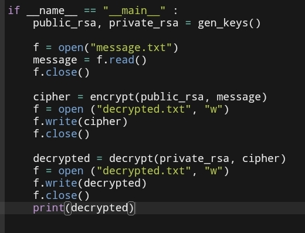

## Diff-Hell
* Zwei Instanzen einer Klasse mit jeweils Namen, die sich gegenseitig kennen.
* Aufrufen einer Methode einer dieser Instanzen, erzeugen der nötigen Zahlen und austausch über Funktionsaufruf(Parameter)->Rückgabe mit der anderen Klasse
* Ausgabe Name und geheime Zahl
* Jede Instanz erzeugt den gleichen 16 byte key aus der geheimen Zahl
* Eine Instanz schickt der anderen zwei vorgebene Keys mit dem 16 byte key mittels AES

## RSA

## AES

